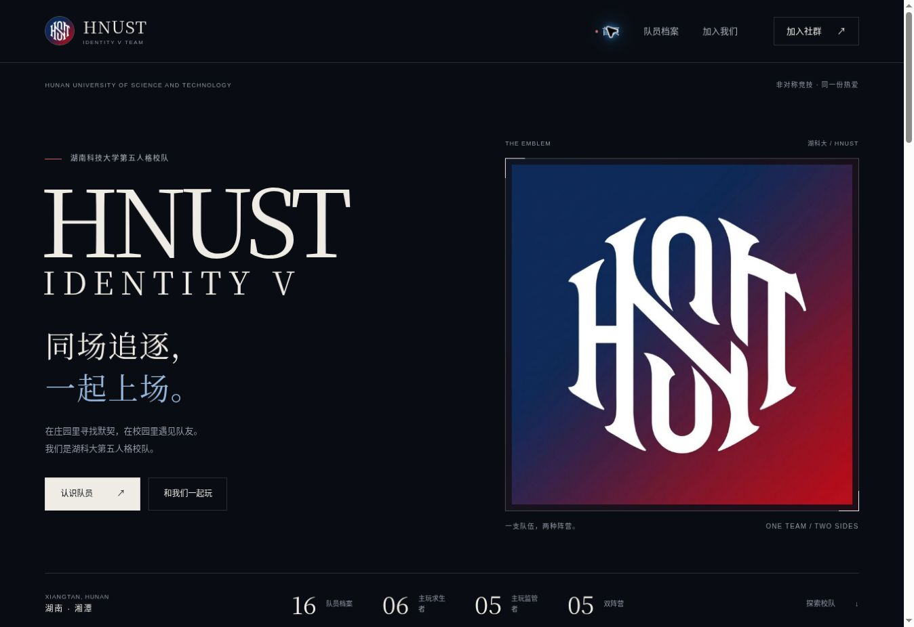

# HNUST 第五人格校队介绍站

湖南科技大学第五人格校队与社群介绍网站，部署于 GitHub Pages。

https://starlevin.github.io/qinghan-site/



## 页面与内容

- 首页：真实队徽、校队介绍、队员预览、社群入口与官方赛事链接。
- 队员目录：16 份游戏档案，按主玩阵营筛选，搜索游戏昵称或队内网名。
- 独立档案：构建时生成 `players/p0001/` 至 `players/p0016/`，分别显示求生者、监管者历史最高段位。
- 加入我们：日常游戏交流、选拔路径、社群二维码原图和公开群号。
- 公开资料说明：展示范围、历史段位说明与更正方式。
- 美术来源：官方游戏场景、佣兵与红夫人立绘及版权来源。
- 首页庄园介绍：求生者与监管者视角可用鼠标和键盘切换。

电脑横屏使用左右双栏首屏，内容宽度最多 1600px；1920px 及以上的队员目录使用六列。窄屏与手机横屏按可用宽度、方向和高度调整，不强制拉伸或裁切正文。

素材来源详见 [官方美术清单](assets/game/README.md)。

资料来自维护者提供的收集表：6 位主玩求生者、5 位主玩监管者、5 位双阵营。原表没有擅长角色、战绩或确切比赛位置，因此不自行补写这些内容。历史段位保留原表记录，不表示当前赛季段位。

## 公开数据边界

原始 Excel 不进入此仓库或部署产物。真实姓名、身份证号、手机号、个人 QQ、游戏 UID、学号、住址等私人字段不得提交，包括隐藏字段、源文件和附件。

`data/team-roster.json` 采用严格白名单：

| 字段 | 用途 |
| --- | --- |
| id | 网站档案编号，不使用游戏账号 |
| nickname | 游戏昵称 |
| alias | 明确标注的队内网名 |
| role | survivor / hunter / flex / support |
| survivorPeak | 求生者历史最高段位 |
| hunterPeak | 监管者历史最高段位 |
| characters | 经确认可公开的角色池，目前为空 |
| rank | 兼容旧版的主要阵营历史段位 |
| intro | 经确认可公开的游戏介绍，目前为空 |

只保留这些字段。构建会拒绝额外字段、联系方式、长号码及不合法编号；人工检查仍然必要。社群群号 648418715 是维护者明确提供的入群入口，与成员个人联系方式不同。

## 维护

直接更新公开 JSON，然后执行构建。`data/team-roster.js` 是源文件本地预览用副本；正式部署时由 JSON 自动生成。更改昵称、历史段位时同步这两个源文件。不要把原表放进项目目录。

保留的 `tools/roster-editor.html` 只在浏览器中提取基础游戏字段，是旧版的辅助工具；它不保留新增的网名和两个阵营历史段位，完整更新请编辑公开 JSON。原表不向服务器上传。工具导出后必须人工审查。

## 本地检查与部署

```sh
python -m unittest discover -s scripts -p test_public.py -v
python scripts/build.py
python -m http.server 8000 --directory dist
```

构建生成 16 个独立 HTML 页面，并仅复制允许的公开文件、两张维护者提供的图片和六张官方美术。GitHub Actions 在 main 更新后自动测试、构建和发布 dist。支持桌面横屏、超宽屏、手机竖屏与横屏排版、键盘操作和减少动画偏好；游戏信息通过 textContent 渲染。

## 来源

- 队徽、社群二维码与游戏资料：维护者提供。
- 学校名称与校训：https://www.hnust.edu.cn/
- 第五人格官网：https://www.identity-v.com/
- IVL 联赛官网：https://ivl.163.com/

学校官网链接不表示学校管理或背书本站。没有可核实的队伍战绩，因此不填成绩、赛事名次或建队日期。
